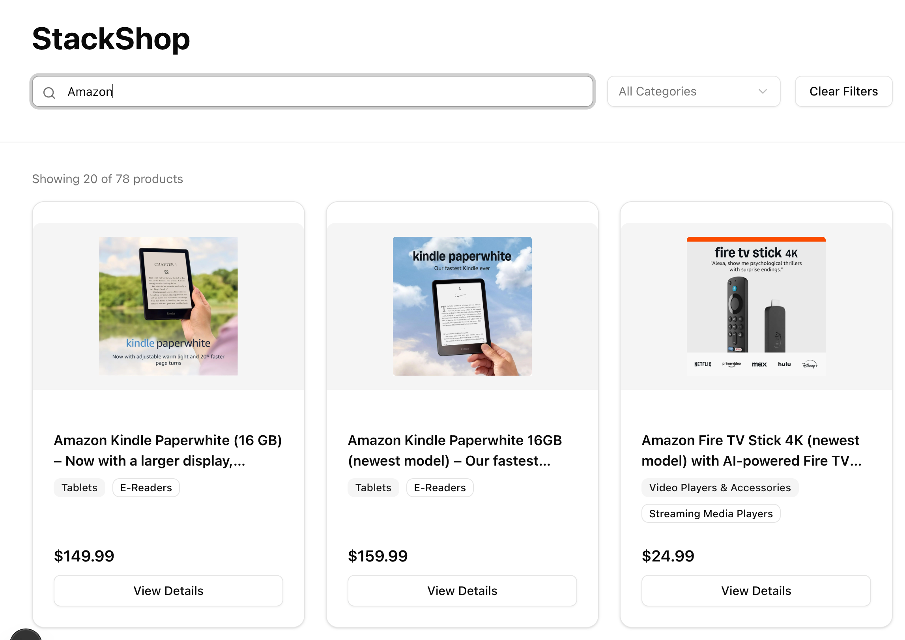
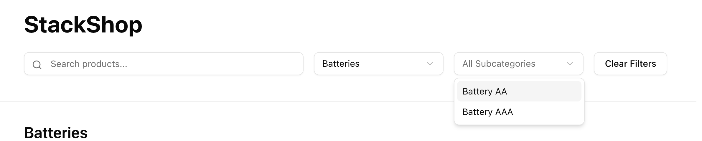
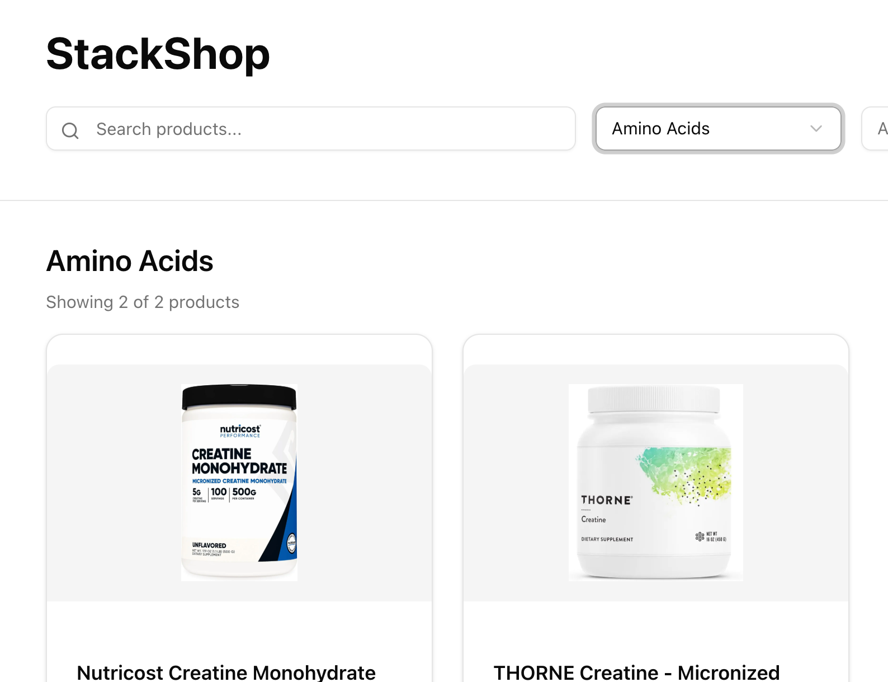

# Stackline Full Stack Assignment

## Overview

This document covers all bug fixes, security improvements, and enhancements made to the web pages.

---

## Functional Bugs
These bugs are discovered through interacting with the different features of the webpage.

### Bug 1: Invalid `next/image` src hostname for Amazon CDN



**File:** `next.config.ts`

**Error:** `Invalid src prop` on `next/image` — hostname `images-na.ssl-images-amazon.com` not configured.

**Root cause:** `next.config.ts` only allowlisted `m.media-amazon.com`. Some products use `images-na.ssl-images-amazon.com` as their image CDN, which was not in `remotePatterns`.

**Fix:** Added `images-na.ssl-images-amazon.com` to the `remotePatterns` array in `next.config.ts`. Next.js requires explicit allowlisting to prevent the image optimization endpoint from being abused as an open proxy. Minimal change, no application logic touched.

---

### Bug 2: Subcategories fetch ignores selected category



**File:** `app/page.tsx:55`

**Root cause:** The subcategories fetch was called without a `?category=` query param:

```ts
fetch(`/api/subcategories`) // ← missing ?category= param
```

As a result, `selectedCategory` state was never sent to the API, so subcategories always returned results across every category rather than filtering by the selected one.

**Fix:** Updated the fetch to include the selected category:

```ts
fetch(`/api/subcategories?category=${encodeURIComponent(selectedCategory)}`)
```

---

### Bug 3: `useSearchParams` used without a Suspense boundary

**File:** `app/product/page.tsx`

**Error:** `useSearchParams() should be wrapped in a suspense boundary at page "/product"`

**Root cause:** `app/product/page.tsx` called `useSearchParams()` directly in the page component with no `<Suspense>` parent. In Next.js 15 App Router, components using `useSearchParams()` must be wrapped in `<Suspense>` . Without it, Next.js throws during static rendering because the server has no access to URL search params at build time.

**Fix:** Split the page into two components in `app/product/page.tsx`. The exported `ProductPage` is a thin shell that wraps `<ProductPageInner>` in a `<Suspense>` boundary. All existing logic (state, `useSearchParams`, JSX) lives in `ProductPageInner`.

---

### Bug 4: TypeError when `imageUrls` or `featureBullets` is null

**Files:** `app/page.tsx`, `app/product/page.tsx`

**Error:** `Cannot read properties of undefined (reading '0')` at `product.imageUrls[0]`

**Root cause:** Some products in the dataset have `null` or missing `imageUrls` and `featureBullets` fields. Directly accessing `[index]` or `.length` on `null`/`undefined` throws a TypeError at runtime.

**Fix:** Applied optional chaining (`?.`) to all unsafe accesses across both pages:

- `app/page.tsx` — `product.imageUrls[0]` → `product.imageUrls?.[0]`
- `app/product/page.tsx`:
  - `product.imageUrls[selectedImage]` → `product.imageUrls?.[selectedImage]`
  - `product.imageUrls.length` → `product.imageUrls?.length ?? 0`
  - `product.featureBullets.length` → `product.featureBullets?.length ?? 0`

Optional chaining short-circuits to `undefined` when the left-hand value is null/undefined, which is falsy and safely skips rendering without throwing.

---

### Bug 5: Fetch calls missing error handling and race condition protection

**File:** `app/page.tsx`

- **Error handling:** All four fetch calls had no `.catch`, leaving loading spinners stuck permanently on network failure.
- **Race condition:** The products and subcategories `useEffect` fetches could return out of order when filters changed rapidly (e.g. typing in the search bar), causing stale results to overwrite fresh ones.

**Fixes applied:**

| Fetch | Error handling | Race condition |
|---|---|---|
| Categories | `.catch(() => setCategories([]))` | n/a — runs once |
| Subcategories | `.catch` clears subcategories | `AbortController` cancels on category change |
| Products (`useEffect`) | `.catch` clears loading state | `AbortController` cancels on filter change |
| `handleLoadMore` | `.catch` clears loading state | n/a — button disabled during load |

`AbortController` is used in the two effects with reactive dependencies. The cleanup function (`return () => controller.abort()`) cancels the in-flight request each time the effect re-runs, ensuring only the latest response is applied.

---

## UX Bugs
These bugs are discovered through interacting with the different features of the webpage.


### Bug 5: "Clear Filters" does not reset dropdown display

**File:** `app/page.tsx`

**Error:** Clicking "Clear Filters" clears React state and re-fetches unfiltered products, but the category and subcategory dropdowns continue showing the previously selected values.

**Root cause:** The shadcn/ui `<Select>` component is backed by Radix UI, which treats `value={undefined}` as a signal to switch from controlled to uncontrolled mode. Once uncontrolled, Radix ignores further `value` prop changes and preserves its last internal display value. The clear handler was setting state to `undefined`, which propagated to the `value` prop and silently handed control back to Radix's internal state.

**Fix:** Changed `value={selectedCategory}` and `value={selectedSubCategory}` to use a nullish coalescing fallback in `app/page.tsx`:

```tsx
value={selectedCategory ?? ""}
value={selectedSubCategory ?? ""}
```

Passing `""` keeps the component controlled at all times. Since no `<SelectItem>` has `value=""`, Radix correctly falls back to rendering the placeholder when state is cleared.

---

## Security Vulnerabilities
These bugs are discovered through examining api calls in fetching product information and how the webpage is consuming JSON objects.

### Security Fix 1: Unbounded `limit` parameter

**File:** `app/api/products/route.ts`

**Risk:** Any caller could pass `?limit=999999` to force the server to serialize the entire dataset in a single response, causing unnecessary CPU and memory load.

**Fix:** Capped the parsed limit with `Math.min(..., 100)` so no request can exceed 100 products regardless of the query param value.

---

### Security Fix 2: Product data spoofing via URL

**Files:** `app/page.tsx`, `app/product/page.tsx`

**Risk:** The product detail page previously parsed and trusted a full product JSON object from the URL (`?product=...`). An attacker could craft a URL with fabricated product data (false titles, misleading descriptions, injected image URLs) and share it as a phishing link — the page would render it as legitimate.

**Fix:**
- `app/page.tsx`: Links now pass only `?sku=<stacklineSku>` instead of the full serialized product.
- `app/product/page.tsx`: The detail page reads the `sku` param and fetches the canonical product from `/api/products/[sku]`. The server is now the single source of truth for all product data.

---


## Enhancements

### Enhancement 1: Product card layout alignment


**File:** `app/page.tsx`

**Problem:** "View Details" buttons were misaligned across cards with different title lengths. Category/subcategory badges were visually cramped and could stretch incorrectly inside the card.

**Changes:**
- Added `flex flex-col` to `Card` — establishes a vertical flex layout so children stack correctly and the footer can be anchored to the bottom.
- Added `flex-1` to `CardContent` — allows the content area to grow and fill available space, pushing `CardFooter` to the bottom consistently across all cards regardless of title length.
- Added `items-start mt-2` to the badge container (`CardDescription`) — prevents badges from stretching to fill the flex container height, and adds consistent spacing between the title and badges.

---

### Enhancement 2: Paginated product listing with "Show More"


**File:** `app/page.tsx`

**Problem:** The product listing was hardcoded to fetch and display only 20 items with no way to load more.

**Changes:**
- Added `total` state populated from `data.total` in the API response to track how many products match the current filters.
- Added `offset` state, reset to `0` on every filter change and incremented by 20 on each "Show More" click.
- Added `loadingMore` state, separate from the initial `loading` state, so the page spinner and the "Show More" button disabled state don't interfere with each other.
- Added `handleLoadMore` function that fetches the next page and appends results to the existing list rather than replacing them.
- Added a "Show More" button below the product grid, visible only when `products.length < total` and auto-hidden once all results are loaded.
- Updated the count label from `Showing X products` to `Showing X of Y products`.

**Design decision:** Filter-driven fetches stay in the `useEffect` (always replace products and reset offset). "Show More" uses an explicit handler (always appends). This separation avoids a race condition where changing filters while `offset > 0` would otherwise trigger two competing fetches.

---

### Enhancement 3: Category heading in product listing


**File:** `app/page.tsx`

**Problem:** When a category or subcategory was selected, there was no visual indication in the main content area of what was being browsed.

**Change:** Added a dynamic `<h2>` heading above the product count that renders only when a category is selected. It displays the category name alone, or `Category — Subcategory` when a subcategory is also active, and is hidden entirely when no category is selected.

---

### Enhancement 4: Retail price display


**Files:** `app/page.tsx`, `app/product/page.tsx`, `lib/products.ts`

**Discovery:** All 500 products in `sample-products.json` contain a `retailPrice` field (range: $1–$1,699.99) that was not being surfaced in the UI.

**Changes:**
- Added `retailPrice: number` to the `Product` interface in `lib/products.ts` so the field is included in all API responses.
- Added `retailPrice` to the local `Product` interfaces in both page files.
- **Listing page** (`app/page.tsx`): Price rendered as `$XX.XX` in the card footer above the "View Details" button.
- **Detail page** (`app/product/page.tsx`): Price rendered prominently in `text-primary` below the product title.
- Both render sites guard with `product.retailPrice &&` defensively for forward compatibility.

